# Natural Gas Forecast

## Scope

The energy sourcing team manages several “active management” hedge programs that allow hedge transactions based on a market view. The objective of this model is to test if we can use linear regression models to support company's energy hedge decisions.  

Specifically, in this work we will develop regression models that forecasts Dutch natural gas futures prices (TTF).  

Finally, it's demonstrated trade signals for making hedge decisions. 

The following topics will be covered: 

1. Building the model: We will describe the dependent and independent variables of the models. We will also explain the data sources and tools we used to pre-process the data and train the regression models.  

2. Estimating the model: Through different iterations we will remove independent variables that are either insignificant or cause multicollinearity. We will explain the different steps we took to go from an initial set of independent variables to the final model.  

3. Using the model: Finally, we will assess if our models can support real life hedge decisions. More specifically we will use a methodology from a paper that was published by Quant Insight in early 20191. The results of this exercise look promising.  

## Building the Model

The dependent variable of our model is the TTF futures price. TTF (Title Transfer Facility) is a virtual natural gas trading point in the Netherlands, where natural gas exchanges ownership between traders. It is operated by Gasunie Transport Services (GTS) who ships natural gas from TTF to any physical delivery point in the Netherlands. 

Spot gas (delivery next day) can be traded in Over the Counter (OTC) markets or on an exchange2. Monthly TTF futures can be traded on the ICE exchange3 or OTC, with acceptable liquidity for the nearest 24-month contracts.  

Based on expertise of the energy markets, we know that the following variables drive the price of TTF and as such would be good candidates for independent variables in our model: 

1. Brent crude oil prices (usd/barrel): There are still several European long-term natural gas supply agreements that are price indexed with oil. Also, oil products are a substitute for natural gas. Brent futures contracts are traded on the ICE exchange4.  

2. CO2 emission prices (Euro/ton): Most of the European natural gas consumers need to surrender CO2 allowances for the tons of CO2 they emit when burning natural gas. EUA futures are traded on the ICE exchange5. 

3. Dutch power prices (Euro/Mwh): Almost half of all Dutch power is generated by gas consuming assets. They are the largest natural gas consumers in the Netherlands. Dutch power futures are traded on the EEX exchange6. 

4. Henry Hub natural gas prices (usd/mmbtu): This is the reference index for US natural gas. The US natural gas market is linked to the European gas market through LNG (Liquefied Natural Gas) arbitrage trading overseas. Henry Hub futures are traded on the Nymex exchange7. 

5. JKM (Japan/Korea Marker) prices (usd/mmbtu): JKM is the main LNG price index for deliveries in Asia. Strong LNG demand in Asia means less LNG deliveries to Europe which will push European gas prices up. JKM futures are traded on the Nymex exchange8. 

6. NBP prices (pence per therm): NBP is natural gas traded and delivered in the UK and is the most liquid natural gas market in Europe. A large amount of spot LNG deliveries to Europe are NBP indexed. Like TTF, NBP is also a virtual trading point. NBP futures are traded on the ICE exchange9. 

6. API4 Richards Bay Coal prices: Coal is competing with natural gas for power generation in Europe. API4 futures are traded on the ICE exchange10. 

The variables listed above are typically discussed during weekly energy meetings and with counterparties. They are also mentioned in various energy market reports as the main price drivers for TTF. Quantifying the relationship between these variables and TTF prices through a regression model would provide more debt to the discussions than just gut feeling. 

TTF natural gas prices are seasonal. We decided to add dummy variables for each month (11 in total). Dummy variable 1 gets value 1 for January prices and 0 for the other months. Dummy variable 11 get value 1 for November prices and 0 otherwise. The regression coefficient of each dummy variable represents the impact of the “month effect” versus base month December with all other variables remaining at the same level. That is why we do not need a dummy variable for December. 

The Reuters tickers for all these variables are summarized in Annex 1. As a convention, we will use these tickers to name the variables in our regression models. All variables have been converted to Euros to eliminate the impact of the currency exchanges between Euros, USD and British Pound. 

We will build 5 multivariable regression models for the rolling month 1 (the nearest month), rolling month 6, rolling month 12, rolling month 18 and rolling month 24 contracts11. For example, the starting model for the rolling month 1 TTF contract is: 

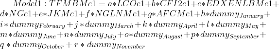

## Estimating the model

When building the model, we quickly discovered the limits of Excel. Especially data preprocessing is tedious in Excel when dates of various datasets need to be aligned and blank cells need to be removed or interpolated. Also, the regression functionality in Excel is very basic and requires a lot of manual work for each run. 

The combination of Reuters, Python and xlwings seems to be much more robust. Reuters Eikon is used as data source for collecting all historic futures prices. It is clean data and has a good interface with Python through the eikon API12. We use price history starting from January 2015 until today. We use Python to write all the code to retrieve and preprocess the data and run the actual regression. For efficient data manipulation, we used the pandas13 package. For the regression we used the statsmodels14 package. Finally, we used xlwings15 to combine the strengths of Excel with the power of Python. Xlwings is an Excel add-in that allows the user to write UDF’s (User Defined Functions) that run on Python code instead of Visual Basic. The user does not need to have any Python knowledge to use the code, because the Python UDF’s look and feel the same as any other Excel function. All Excel files and Python code are posted on GitHub16. 

The migration from initial model to final model follows a few simple iterative steps. We started by inspecting the scatter plots in Appendix 2. Based on this analysis, we decided to eliminate CO2 because it did not show any evidence of linear relationship with TTF prices. 

Our final objective is to have a model with a high adjusted R-squared17, no insignificant variables and no autocorrelation. The adjusted R-squared tells us how well the regression model fits the observed TTF prices. It is the percentage of the variation in the TTF price that is explained by the regression model. The significance of an independent variable can be measured by testing the null hypothesis that the regression coefficient of that variable is zero. A low p-value (<0.05) for a variable in the regression statistics tells us that we can reject this null hypothesis with 95% confidence and keep that variable in the model. Each time we eliminate an insignificant variable from the model, we need to rerun the regression and check the p-values of the remaining variables18. Once we have removed all the insignificant variables, we check for multicollinearity between the remaining independent variables. If 2 independent variables have a correlation which is above 70%, then we eliminate 1 of these 2 variables. Typically, we eliminate the variable that is highly correlated with multiple other independent variables in the model.   

The final model is the result of this iterative elimination process. In appendix 3, we show the steps that get us to the final Model 1. The final models 2-5 are developed using the same elimination process. 

----The linear equation for the final model 1 is: 

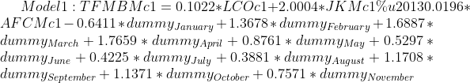

The linear equations of the other 4 models as well as the regression statistics can be found in appendix 4. The adjusted R-squared is for all the models above 0.98, which is a good result. We can also see that the p-values for all the final independent variables is smaller than 0.05 and that all multicollinearity has been removed. 

## Using the Models 

One way to use our models for hedge decisions is by comparing the forecasts of the model with the traded price in the market. We consider the forecasted TTF price to represent the fair value. If the fair value is higher than the market price, then we could conclude that TTF is underpriced according to our model and that there might be a buy opportunity. In the opposite case we have a sell opportunity. 

In this section we will analyze if the fair value of our model generates a useful trade signal. A similar analysis was done by Quant Insight (Qi) in early 201919.  Qi developed a linear regression model based on macro data and proved that the “Fair Value Gap” (FVG) of this model could generate profit making trade signals. Our definition of FVG is similar as in the Qi paper. It is the difference between the normalized z-scores of the model price and the market price.  To calculate the model price, we use the variables of the final models from the previous section but we re-train the regression models using data over a 250-day lookback period. We use this re-trained model to calculate the FVG on day 250 of this lookback period. Next, we roll this 250-day period forward by 1 day and re-train the model with the new data set. This new model is used to calculate the FVG of the next day. Etc.20  

The next step is converting the FVG into trade signals. For the first month TTF contract (TFMBMc1) we calculate the 20-day moving average of the FVG on a given day. If this moving average is negative, we label that day “bullish” and if the 20-day moving average of the FVG is positive we label that day “bearish”. For each day that is labeled “bearish”, we calculate the price movement over the next 20 days. We do the same calculation for the “bullish” days.

For the first month TTF contract (TFMBMc1), we come to the following conclusions: 

1. For the “bullish” labeled days, TTF prices increased on average by 2.41% over the next 20-day period. The 99% confidence interval around this mean return is [0.95%;3.86%]21. So, with a 99% probability the average 20-day return of a “bullish” labeled day falls within this interval. This shows that there is strong evidence that a “bullish” labeled day has indeed a bias to show an upward price move over the next 20 days. 

2. For the “bearish” labeled days, TTF prices decreased on average by -3.75% over the next 20-day period. The 99% confidence interval around this mean return is [-5.8%;-1.69%]. So, with a 99% probability the average 20-day return of a “bearish” labeled day falls within this interval. This shows that there is strong evidence that a “bearish” labeled day has indeed a bias to show a downward price move over the following 20 days. 

We performed the same analysis for all 5 models. In all cases we came to similar conclusions, but we needed to tweak some of the parameters. The summary table in appendix 5 shows that for some of the models we could only get to the same conclusion for 90% Confidence Intervals. Also, we noticed that the models for the longer dated TTF contracts (model 3-5) could only give useful signals for returns over a longer period. For example, for model 3 (TTF 12 month rolling contract) we needed to look at the 30 day returns and needed to calculate the FVG moving averages over a 30-day period. But this is in line with the decreasing price volatility we see for the longer dated TTF futures contracts in the market. Appendix 6 provides a visual representation of the model 3 outputs. 

## Conclusion

In this paper we investigated if a “simple” regression model can support energy hedge decisions. One could claim that more sophisticated machine learning models would be needed. But we found that a good choice of a few independent variables resulted in regression models with a high adjusted R-squared. The advantage of a “simple” regression model versus more sophisticated approaches, like neural networks, is that the regression model is not a black box. It is rather the result of brainstorm sessions with market specialists about relevant independent variables. Because of its simplicity, the predictions of the regression model are easy to interpret and can trigger meaningful discussions among the market specialists. It also focuses the discussion on the relevant variables that drive the market instead of noise that obscures the picture. 

We also investigated if our regression models have any predictive value for explaining the price movement of the TTF futures contracts. Based on Quant Insight’s Fair Value Gap method, we found some evidence that this is the case for our 5 regression models. This provides us arguments to further refine our models. For example, the Qi model was based on 30-35 macro variables. They first employed Principal Component Analysis on the macro variables before the regression step. We need to look for additional variables that can explain the TTF price movements and consider a similar approach as the Qi model. 

We could also investigate if the performance of the models would improve if we generated regression models for the independent variables. So instead of feeding the TTF model with futures prices of the independent variables, we feed it with their fair value. 

Finally, we could try out more sophisticated machine learning techniques. But it would be more difficult to interpret the outputs of the model and hence less useful for our market meetings.

### (Appendix 1) Reuters tickers for model variables

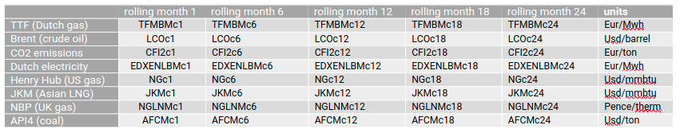

### (Appendix 2) Scatter Plot

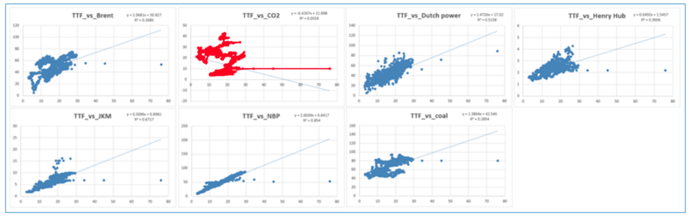

### (Appendix 3) Elimination process for independent variables (Model 1) 

#### Step1: eliminate Dutch power (EDXENLBMc1) and US gas (NGc1) based on high p-values 

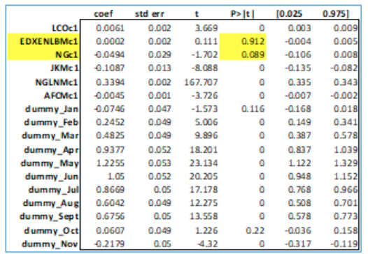

#### Step2: all remaining variables (excl. month dummies) have p-values < 0.05. UK gas (NGLNMc1) is 90% correlated with Asian LNG (JKMc1) => UK gas removed from model. 

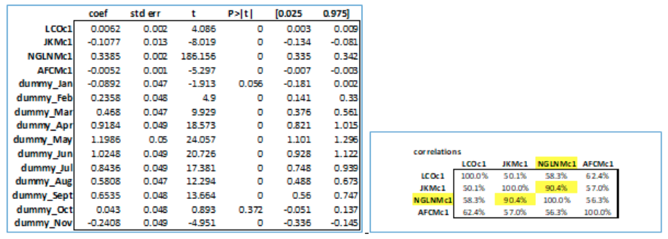

#### Step3 : The final model consists of 3 variables and 11 dummy variables.   

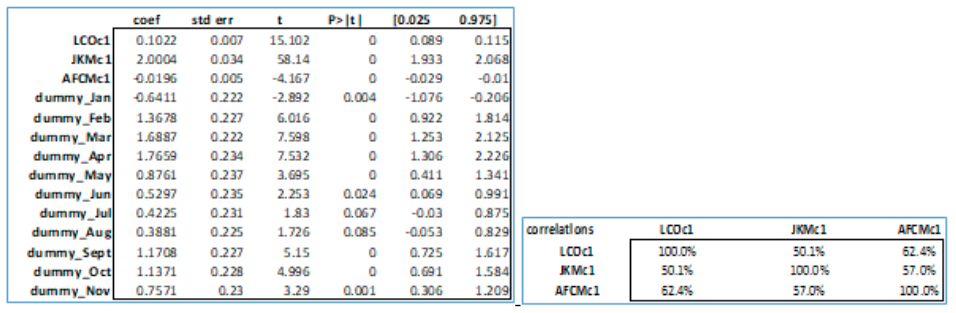

### (Appendix 4) final regression models and regression statistics  

#### Model 1:

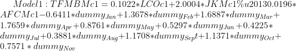

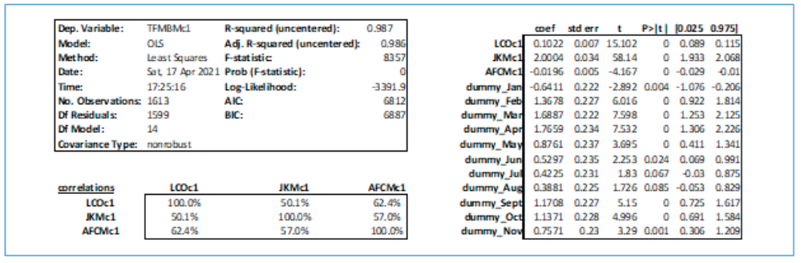

#### Model 2:

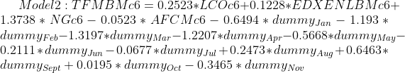

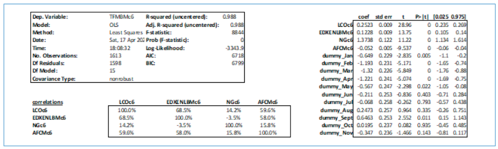

#### Model 3:

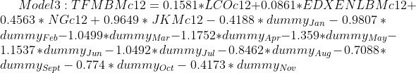 

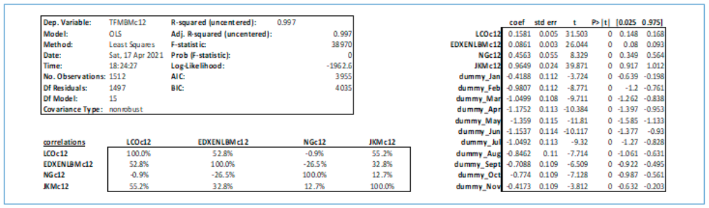

#### Model 4:

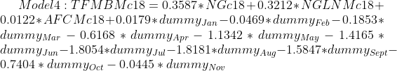

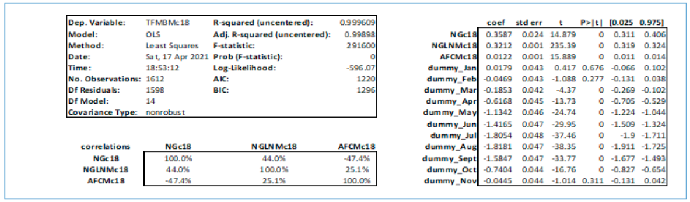

#### Model 5:

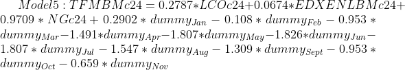

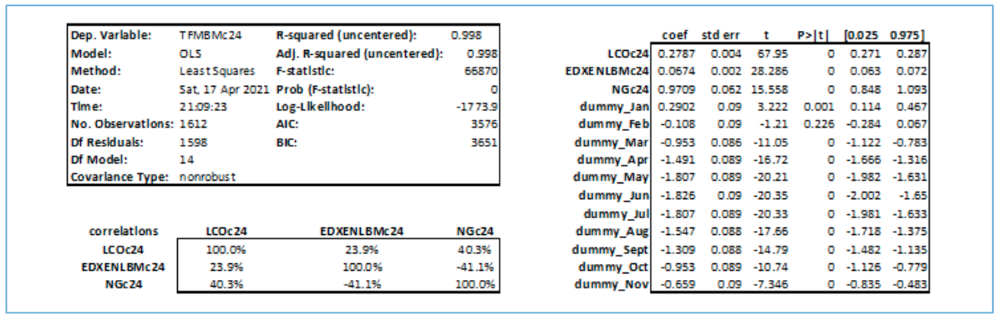

### (Appendix 5) Confidence intervals for “bullish” and “bearish” returns

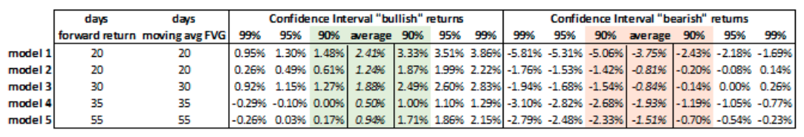

### (Appendix 6) Visualization of model 3 results

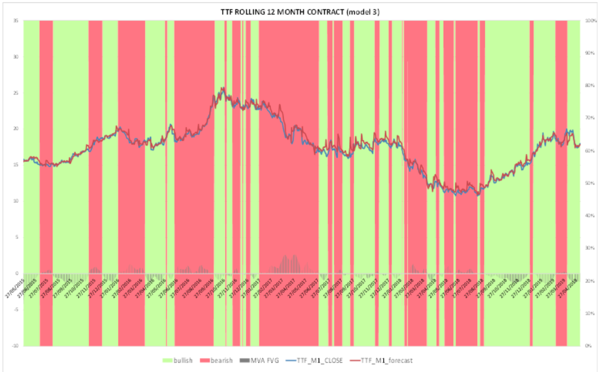
